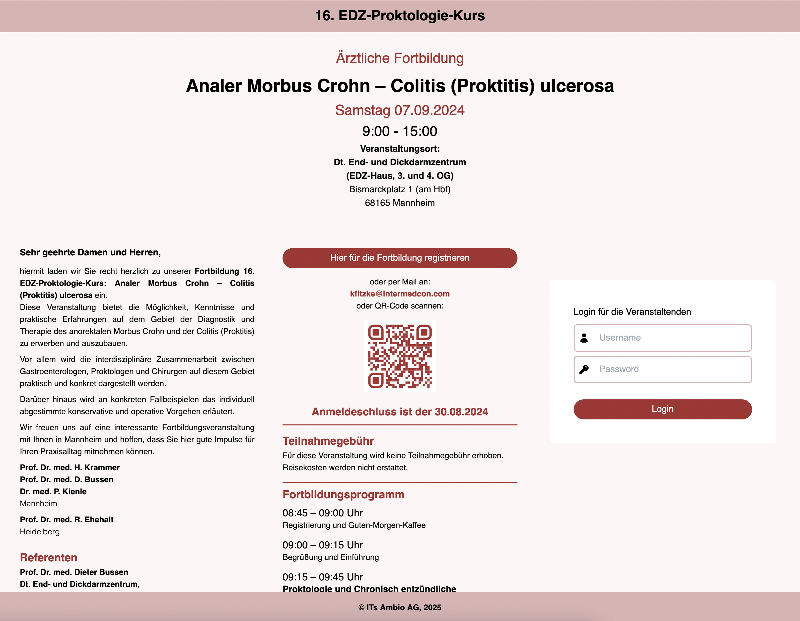
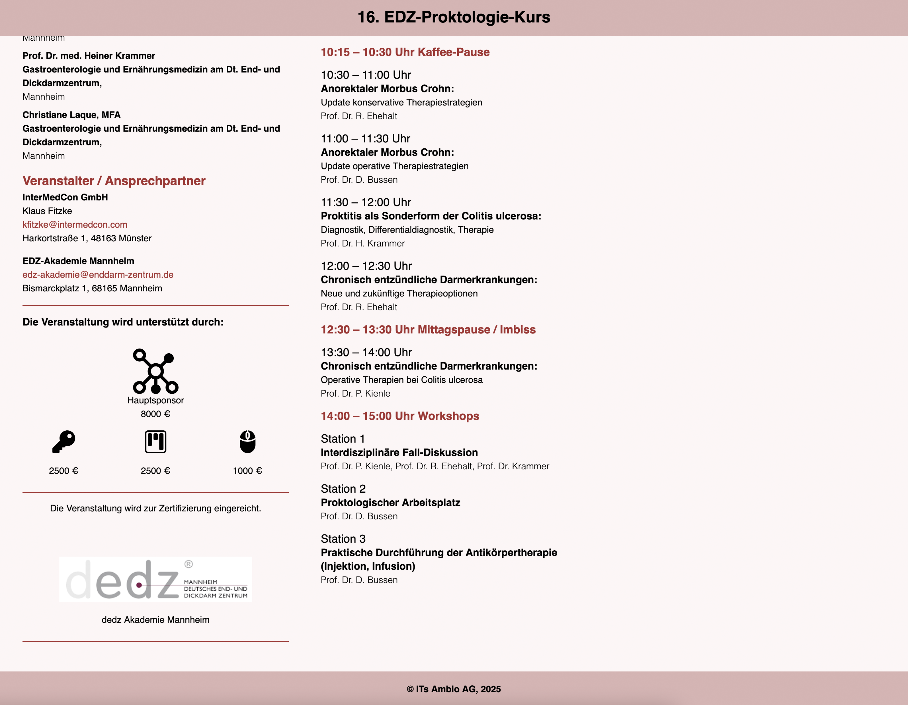
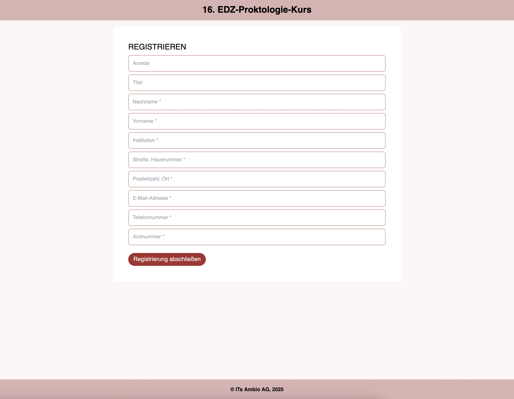
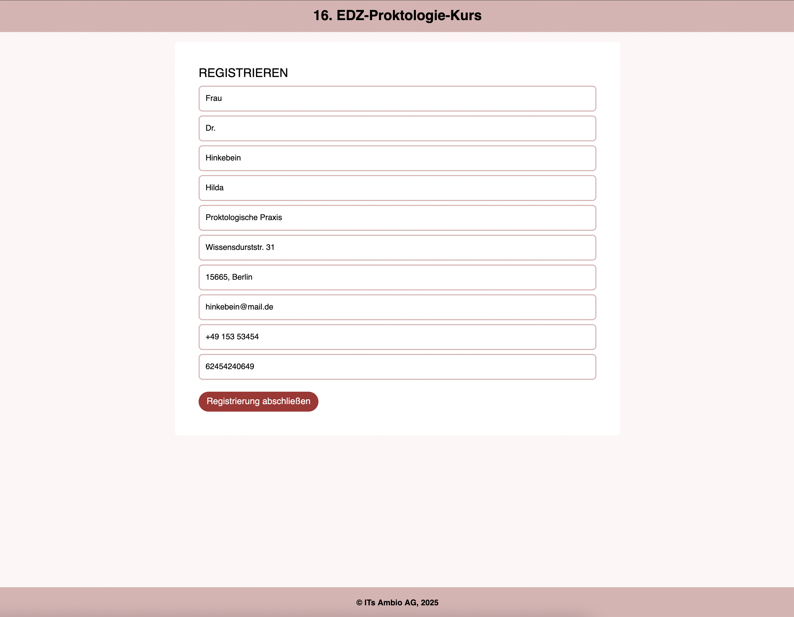
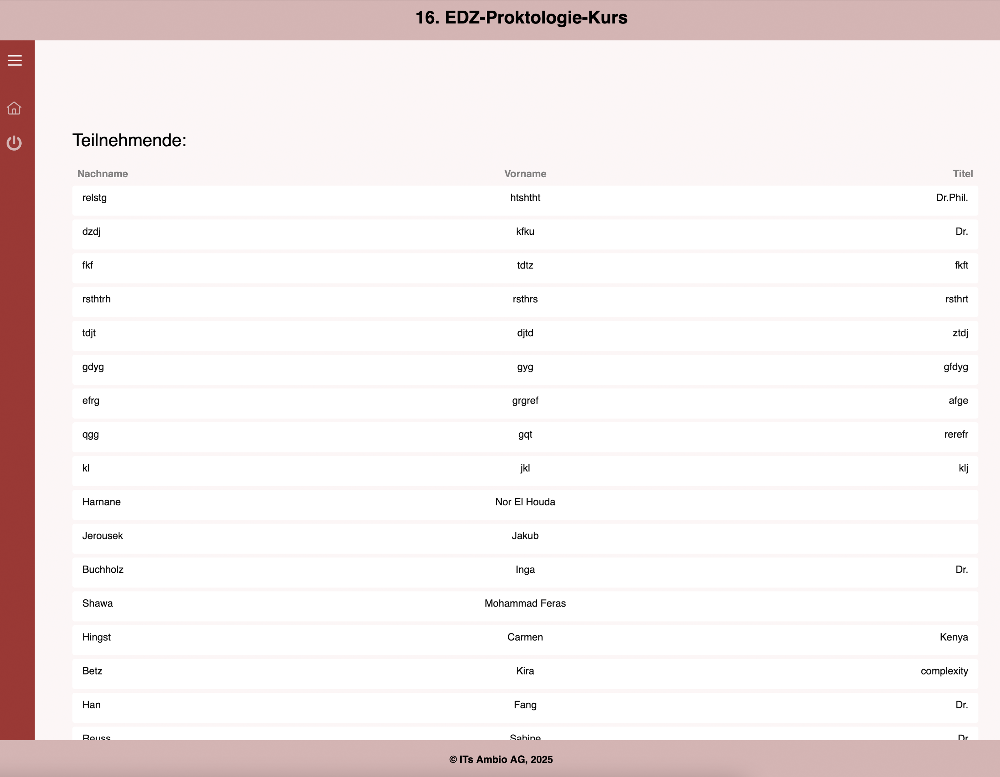
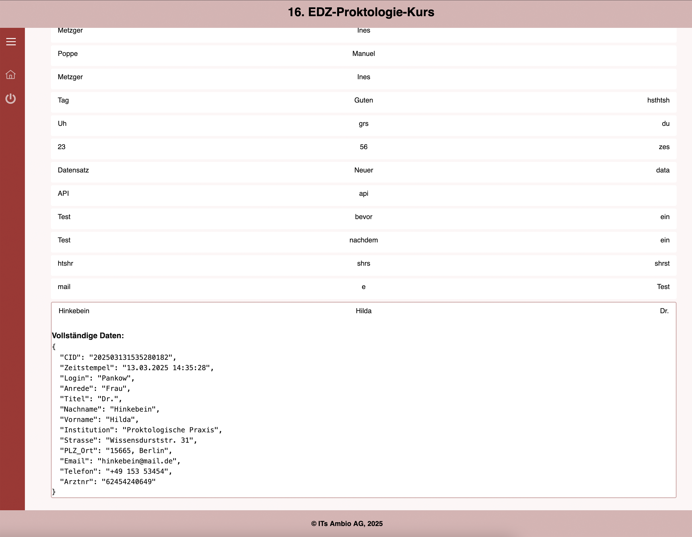

# Projekte

Meinen vollständigen Lebenslauf finden Sie [hier](LEBENSLAUF.md).

## Projekt Buchungsplattform für eine medizinische Veranstaltung

Diese Anwendung habe ich während meiner Praktikumszeit in der Firma IT’s Ambio implementiert.

### Projektbeschreibung:
Das End- und Dickdarmzentrum (im Folgenden EDZ) bietet jährlich eine Fortbildung für Ärzt*innen zum Thema Morbus Crohn an. Die Aufgabe war, anhand einer vorhandenen Default-Anwendung mit Next.js eine Anwendung zu bauen, die:

- Eine Registrierfunktion für Interessierte hat, über die sie sich für den Workshop anmelden können
- Eine Login-Funktion, über die man auf ein Dashboard kommt, auf dem die Datensätze der Registrierten angezeigt werden
- Informationen eines Flyers der Veranstaltung aus dem letzten Jahr enthält und angelehnt an diesen Flyer mit Tailwind gestaltet ist

### Genutzte Technologien:
- Next.js
- Tailwind CSS

### Die Homepage/Landing Page
Auf der Homepage sind die Informationen zum Workshop zu finden. Außerdem sollten Mitarbeiter*innen des EDZ hier die Login-Funktion vorfinden, während Interessierte einen Link zum Registrierformular finden. Die Informationen für den Text und Bilder, Icons et cetera habe ich in einer JSON-Datei angelegt, sodass die Seite der Homepage, die schon JSX-Tags mit den Stylings enthält, nicht zu unübersichtlich wird. Die Daten, die ich zunächst von der letzten Veranstaltung übernommen habe, können so leichter für den nächsten Workshop angepasst werden, wenn es dann so weit ist.

### Die Registrierungspage
Auf diese Seite kommt man, wenn man den Registrieren-Button auf der Homepage klickt. Alle für die Registrierung erforderlichen Daten werden hier eingetragen, abgesendet und im Backend verarbeitet. Dort werden sie in einer REST-API gespeichert. Der Default-Text zeigt die erforderliche Eingabe an. Um die Funktion zu testen, habe ich Daten eingegeben.

### Das Dashboard
Die Mitarbeitenden des EDZ haben nach erfolgreichem Login (Formular auf der Homepage) Zugriff auf das Dashboard, auf dem eine Liste der registrierten Besucher*innen des Workshops aufgeführt ist. Die Listenelemente enthalten Nachnamen, Vornamen und Titel, und sind gleichzeitig Buttons. Beim Klicken auf eine Zeile öffnet sich der jeweilige gesamte Datensatz. Klickt man auf einen anderen Datensatz, geht der aktuelle zu und der andere Datensatz geht auf. Klickt man ins Leere, geht der Datensatz wieder zu.

## Übungsprojekte aus der Weiterbildung zur Backend-Entwicklerin und Datenbank-Entwicklerin

Während meiner Weiterbildung bei Bergemann und Höhne mit den Modulen Backend-Entwicklung und Datenbank-Entwicklung übte ich mich an verschiedenen Übungen und Projekten. Eine Auswahl gibt es hier. **Hinweis:** Um meinen Lernfortschritt festzuhalten, sind die Dokumentationen teilweise sehr ausführlich ausgefallen. Vielleicht sind sie dennoch unterhaltsam.

- Übungsprojekt MongoDB: https://github.com/MaPankow/MongoDB_Rezepte_Social_Network
- Übungsprojekt PostgreSQL: https://github.com/MaPankow/PostgreSQL_Onlineshop
- Übungsprojekt MariaDB und SQLite: https://github.com/MaPankow/Artivity---Datenbankenprojekt-mit-MariaDB-und-SQLite
- Übungsprojekt Anwendung für Java Spring: https://github.com/MaPankow/Orders-Spring-exercise
- Übungsprojekt Anwendung für Django: https://github.com/MaPankow/Restaurant-Django-exercise

